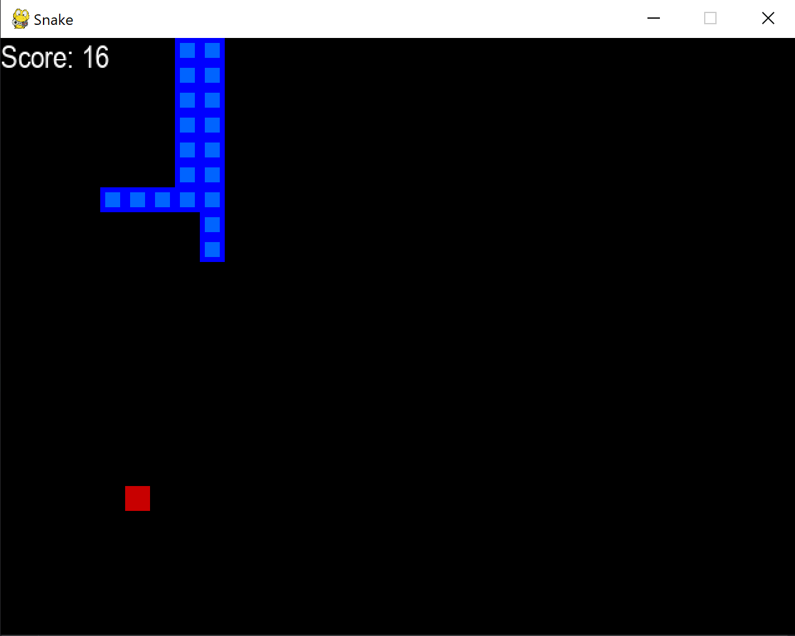

# Snake AI

Welcome to my Snake AI project, a classic snake game with a twist! This project offers two modes of gameplay: one for human players and another for watching an AI learn and progressively get better at playing the game.

## Features

- **Human Mode**: Take control and guide the snake using keyboard arrow keys.
- **AI Mode**: Watch an artificial intelligence learn the game, improving after each round.
- **Performance Tracking**: Visualize the AI's progress with dynamic score plots showing the score and average score for each game played.



## Getting Started

### Prerequisite

Ensure you have Python 3.X installed on your machine. This game was developed and tested with Python 3.10.6.

### Installation

Clone this repository to your local machine, navigate to the project directory and install the necessary dependencies using the provided `requirements.txt` file:

```
git clone https://github.com/nicolasjusten95/snake-ai.git
cd snake-ai
pip install -r requirements.txt
```

## Playing the Game (Human)

To play the game as a human, use the following command inside the project directory:

```
python snake_game_human.py
```

Control the snake using the arrow keys on your keyboard. Try to eat as many fruits as possible without colliding with the walls or the snake's own body.

## Watching the AI Play

To watch the AI learn and play the game, run:

```
python agent.py
```

This mode uses reinforcement learning to improve the AI's gameplay over time. You can watch the AI play and see a plot displaying its score and average score for each game. The plot updates in real-time as the AI learns.

## Can You Beat the AI?

Now that you know how to play and watch the AI, it's time for a challenge! Can you score higher than the AI? Play the game, improve your skills, and see if you can outperform the AI's best score.


